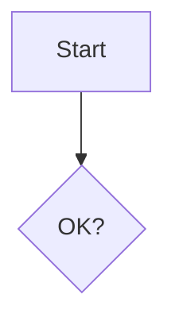

# Title

Intro with **bold**, *italic*, and `code`.

## Section Two

| A | B |
|---|---|
| 1 | 2 |

```python
def f(x):
    return x + 1
```


```mermaid
graph TD
  A[Start] --> B{OK?}
```


## Section Two
